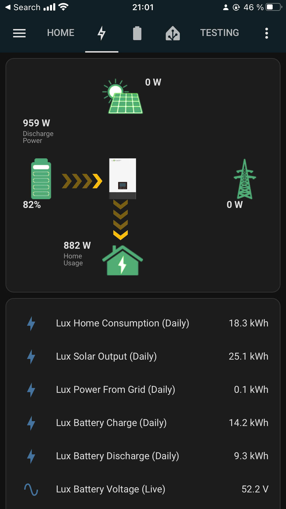
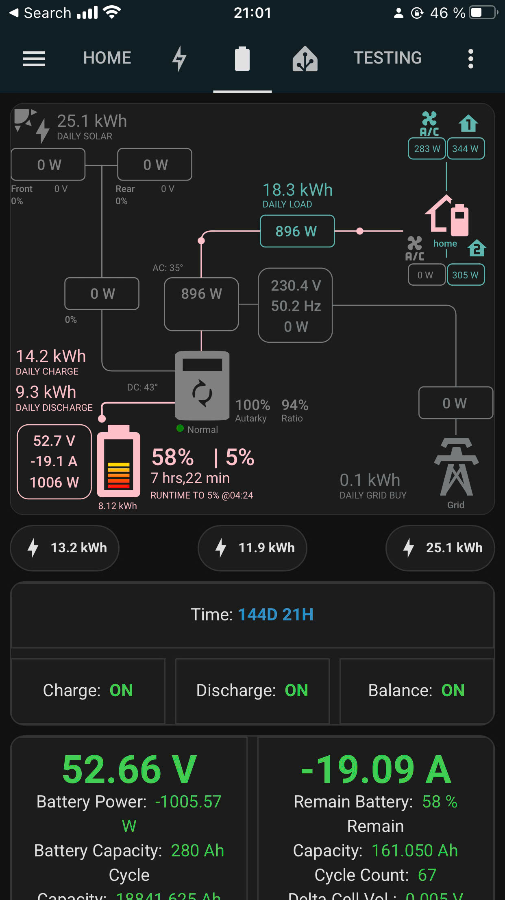
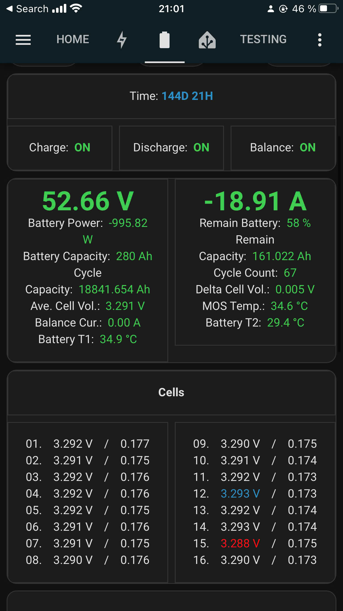
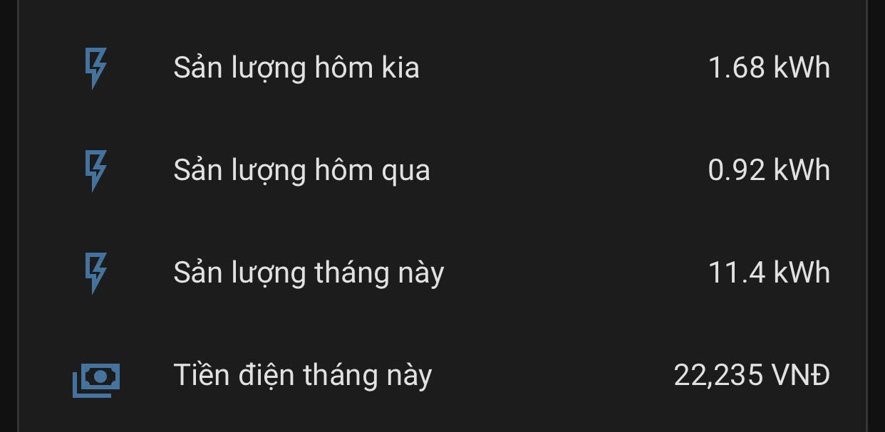

# I. Giới thiệu SolarBox

## 1. Giới thiệu
SolarBox thật ra là tvbox được mod lại để chay server [homeassitant](https://www.home-assistant.io/) để đạt giá thành rẻ

- Nếu nhu cầu chỉ theo dõi biến tần (lux,..) ~500K
- Theo dõi biến tần + Pin lithium không giao tiếp (Jk) ~600K
<!--
Demo: https://demo-solar.xuantran.uk
user: demo
password: demo
-->

## 2. SolarBox dùng để theo dõi biến tần
Với SolarBox bạn có thể theo dõi song song nhiều biến tần của nhiều hãng khác nhau trên cùng một ứng dụng không phụ thuộc vào server của hãng, thời gian cập nhật nhanh.

  
  

## 3. SolarBox dùng để theo dõi Pin không giao tiếp
Với SolarBox bạn có thể theo dõi song song nhiều Pin lithium của nhiều hãng khác nhau trên cùng một ứng dụng.

## 4. Solarbox có thể kết nối từ bất kì đâu
Solarbox hỗ trợ người dùng theo dõi biến tần và bms từ bất kì nơi nào nếu có kết nối internet (wifi công cộng, 4g ...)

## 5. SolarBox dùng để tạo thông báo
Với Solarbox có thể dùng để tạo thông báo, ví dụ: 
- Thông báo khi mất điện.
- Thông báo khi pin đầy.
- Thông báo khi pin sắp cạn.
- ...

## 6. SolarBox dùng để thực thi task tự động
Với Solarbox có thể dùng để thực thi task tự động, ví dụ:
- Tự động mở tải khi PV dư mà pin đầy
- Tự động ngưng xả khi pin còn quá thấp và còn điện lưới.
- Tự động thay đổi giới hạn dòng xả của pin. VD: ngày xả 40A tối xả 60A

## 7. SolarBox dùng để theo dõi chỉ số điện từ server EVN
Với Solarbox có thể dùng để theo dõi chỉ số địen từ EVN server.

## 8. SolarBox dùng để kết nối các thiết bị nhà thông minh
Đang cập nhật .... 

# II. Nguyên Lý Hoạt Động
## 1. Mô hình SolarBox không hỗ trợ wifi & bluetooth
- Mô hình này cần có thêm module theo dõi pin lithium, nhiệm vụ của module này dùng để tạo kết nối bluetooth với JK BMS để thu thập dữ liệu và gửi thông tin về SolarBox thông qua wifi. **Do kết nối bluetooth của JK BMS rất ngắn nên module này cần được đặt gần Pin Lithium (khoảng 20cm)**
- SolarBox sẽ hoạt động như [homeassitant](https://www.home-assistant.io/) server. SolarBox sẽ thu thập thông tin từ module wifi của biến tần lux và module theo dõi Pin Lithium

Đang cập nhật hình ảnh .... 

## 2. Mô hình SolarBox hỗ trợ wifi và bluetooth
- SolarBox sẽ thiết lập kết nối với Pin Lithium thông qua bluetooth, và module wifi Lux thông qua wifi
- SolarBox sẽ hoạt động như homeassitant server. SolarBox sẽ thu thập thông tin từ module wifi của biến tần lux và Pin Lithium
- **Do kết nối bluetooth của JK BMS rất ngắn nên SolarBox cần được đặt gần Pin Lithium (khoảng 20cm)**

Đang cập nhật hình ảnh .... 
# Bonus: Hướng dẫn tạo 1 SolarBox cho riêng bạn

1. Cài đặt hassio

- Xác định chip của tv box của bạn
- Tải image tương ứng với model tvbox của bạn [tại đây](https://github.com/ophub/amlogic-s9xxx-armbian/releases/tag/Armbian_HassIoSupervisor_bookworm_save_2024.09)
- Cài đặt hassio như hướng dẫn [tại đây](https://www.youtube.com/watch?v=bb8F20rgEJ4)

2. Cài đặt addon lux

- sử dụng lxp-bridge [tại đây](https://github.com/celsworth/lxp-bridge)
- Đang cập nhật hướng dẫn tiếng việt ...

3. Nhóm hỗ trợ
https://web.facebook.com/groups/535518005787356

