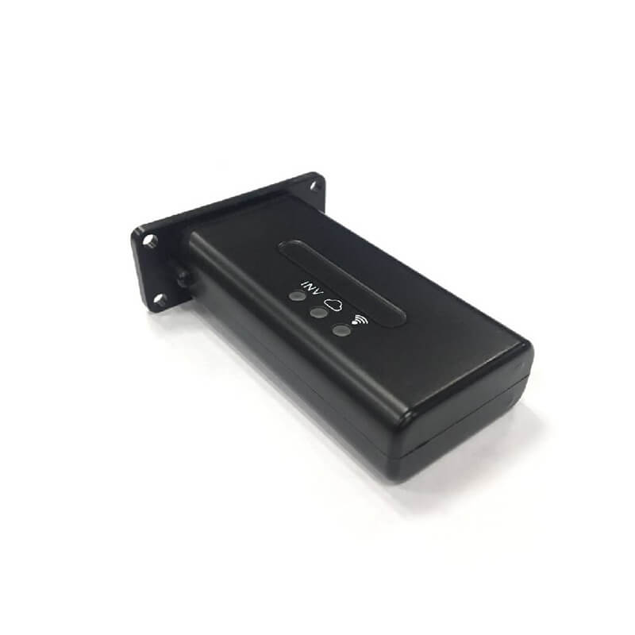
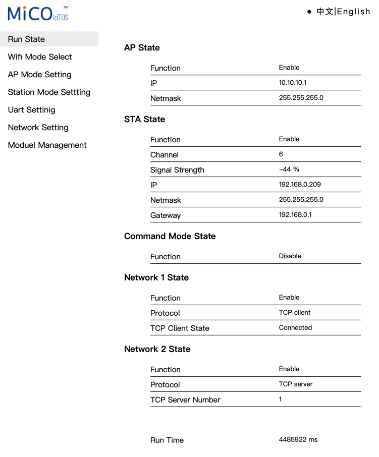
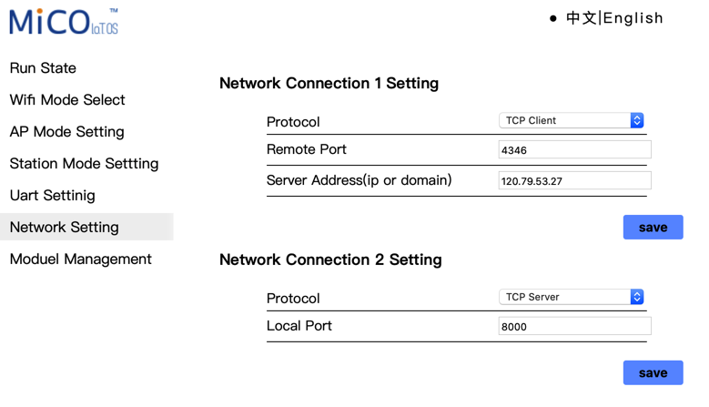

# I. Giới thiệu SolarBox

## 1. Giới thiệu
SolarBox thật ra là tvbox được mod lại để chay server [homeassitant](https://www.home-assistant.io/) 

<!--
Demo: https://demo-solar.xuantran.uk
user: demo
password: demo
-->

## 2. SolarBox dùng để theo dõi biến tần
Với SolarBox bạn có thể theo dõi song song nhiều biến tần của nhiều hãng khác nhau trên cùng một ứng dụng không phụ thuộc vào server của hãng, thời gian cập nhật nhanh.
 

## 3. SolarBox dùng để theo dõi Pin không giao tiếp
Với SolarBox bạn có thể theo dõi song song nhiều Pin lithium của nhiều hãng khác nhau trên cùng một ứng dụng.

## 4. SolarBox dùng để tạo thông báo
Với Solarbox có thể dùng để tạo thông báo, ví dụ: 
- Thông báo khi mất điện.
- Thông báo khi pin đầy.
- Thông báo khi pin sắp cạn.
- ...

## 5. SolarBox dùng để thực thi task tự động
Với Solarbox có thể dùng để thực thi task tự động, ví dụ:
- Tự động mở tải khi PV dư mà pin đầy
- Tự động ngưng xả khi pin còn quá thấp và còn điện lưới.
- Tự động thay đổi giới hạn dòng xả của pin. VD: ngày xả 40A tối xả 60A

## 6. SolarBox dùng để theo dõi chỉ số điện từ server EVN
Với Solarbox có thể dùng để theo dõi chỉ số địen từ EVN server.

## 7. SolarBox dùng để kết nối các thiết bị nhà thông minh
Đang cập nhật .... 

# II. Nguyên Lý Hoạt Động
## 1. Mô hình SolarBox không hỗ trợ wifi & bluetooth
- Mô hình này cần có thêm module theo dõi pin lithium, nhiệm vụ của module này dùng để tạo kết nối bluetooth với JK BMS để thu thập dữ liệu và gửi thông tin về SolarBox thông qua wifi. **Do kết nối bluetooth của JK BMS rất ngắn nên module này cần được đặt gần Pin Lithium (khoảng 20cm)**
- SolarBox sẽ hoạt động như [homeassitant](https://www.home-assistant.io/) server. SolarBox sẽ thu thập thông tin từ module wifi của biến tần lux và module theo dõi Pin Lithium

Đang cập nhật hình ảnh .... 

## 2. Mô hình SolarBox hỗ trợ wifi và bluetooth
- SolarBox sẽ thiết lập kết nối với Pin Lithium thông qua bluetooth, và module wifi Lux thông qua wifi
- SolarBox sẽ hoạt động như homeassitant server. SolarBox sẽ thu thập thông tin từ module wifi của biến tần lux và Pin Lithium
- **Do kết nối bluetooth của JK BMS rất ngắn nên SolarBox cần được đặt gần Pin Lithium (khoảng 20cm)**

Đang cập nhật hình ảnh .... 

# III. Thông tin cần thiết để có thể cài đặt SolarBox 
## 1. Để giao tiếp với biến tần
- Địa chỉ IP của nội bộ của biến tần (có thể hỗ trợ từ xa)
- Thông tin đăng nhập của module wifi của biến tần (mặc định admin/admin)(có thể hỗ trợ kiểm tra)
- Số S/N của module wifi của biến tần (có thể xem tem dán trên module wifi hoặc app lux)

- Số seri biến tần của bạn (có thể kiểm tra trên app lux)
## 2. Để giao tiếp với Pin Lithium
- Tên và mật khẩu wifi của bạn nếu sử dụng mô hình #1
- Địa chỉ mac của BMS JK (có thể hỗ trợ từ xa)

# IV. Hướng dẫn cài đặt và sử dụng
## 1. Đăng nhập homeassitant
[[SolarBox] Đăng nhập homeassistant](https://www.youtube.com/watch?v=Zfy2XWQpMYM)
## 2. Thiết lập kết nối đến biến tần
### a. Thiết lập biến tần

Để tránh các vấn đề phát sinh, bạn nên đảm bảo rằng Biến tần của bạn có địa chỉ IP tĩnh hoặc được đặt DHCP Reservation từ router của bạn. Điều này sẽ đảm bảo rằng địa chỉ IP của nó sẽ không thay đổi khi khởi động lại.

Chúng ta cần cấu hình nó để mở một cổng khác mà chúng ta có thể giao tiếp. Mở trình duyệt web đến IP của datalogger của bạn (có thể phải kiểm tra máy chủ DHCP để tìm nó) và đăng nhập với tên người dùng/mật khẩu admin/admin. Nhấp vào English ở góc trên bên phải :)

Bạn sẽ thấy:

Nhấp vào Network Setting trong menu. Bạn sẽ thấy hai biểu mẫu, biểu mẫu trên cùng được điền với IP của LuxPower ở Trung Quốc - biểu mẫu thứ hai chúng ta có thể sử dụng. Cấu hình nó để trông giống như bên dưới và lưu lại:

Sau khi datalogger khởi động lại (chỉ mất vài giây và không ảnh hưởng đến hoạt động chính của biến tần, nó sẽ tiếp tục hoạt động bình thường), cổng 8000 trên IP của biến tần của bạn sẽ có thể truy cập được từ SolarBox. 

### b. Thiết lập kết nối
1. Settings > Devices and Services > Add Integration trong Home Assistant.
2. Search for "LuxPower Inverter".

3. Điền IP, Cổng (8000), số serial của dongle và số serial của biến tần (có sẵn trên trang web Lux tại server.luxpowertek.com).

4. Sau khi thêm tích hợp, bạn sẽ thấy một số cảm biến trong Home Assistant.

[Video [SolarBox] Kết nối với biến tần](https://www.youtube.com/watch?v=g12Ak6pNzmc)
## 3. Thiết lập kết nối đến pin Lithium
Đang cập nhật ...

# Bonus: Hướng dẫn tạo 1 SolarBox cho riêng bạn
Đang cập nhật .... 
