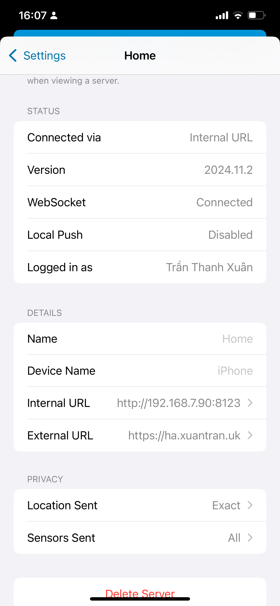

# Hướng dẫn này dành cho các bạn sử dụng solarbox bên mình setup sẵn
## 1. Gửi một số thông tin cho mình
- Serial number (SN) của module wifi. Xem trên web hoặc có thể xem trực tiếp trên module wifi. 
- Tên wifi và password **2.4** nhà bạn (module theo dõi pin sẽ kết nối vào wifi nhà bạn để truyền dữ liệu về hass nên mình cần thông tin này) **Lưu ý** module chỉ hoạt động với wifi 2.4Ghz
<!-- - Địa chỉ MAC của BMS JK cần theo dõi bằng các phần mềm scan bluetooth trên điện thoại.  -->
## 2. Đăng nhập vào ứng dụng homeassitant
- Cài đặt ứng dụng cho [Ios](https://apps.apple.com/app/home-assistant/id1099568401?itsct=apps_box_badge&itscg=30200) hoặc [Android](https://play.google.com/store/apps/details?id=io.homeassistant.companion.android&pcampaignid=pcampaignidMKT-Other-global-all-co-prtnr-py-PartBadge-Mar2515-1&pcampaignid=pcampaignidMKT-Other-global-all-co-prtnr-py-PartBadge-Mar2515-1)
- Cắm nguồn và dây mạng cho box
- Ngắt kết nối app BMS trên điện thoại thông minh
- Cấp nguồn cho module thay đổi pin bằng cốc sạc điện thoại và đặt module ngay cạnh pin.
- Đăng nhập với thông tin mình gửi. [Video hướng dẫn](https://youtube.com/shorts/DpIyl63lWtc?feature=share)
- Inbox mình để cài đặt từ xa (Mình sẽ cài đặt vào buổi tối)
- Đổi mật khẩu sau khi mình cài đặt xong 
<!--
- Kết nối với biến tần. Mình có thể hổ trợ từ xa hoặc bạn có thể kết nối bằng[Video hướng dẫn](https://www.youtube.com/shorts/g12Ak6pNzmc)
- Nếu gặp vấn đề gì inbox mình hỗ trợ   -->
## 3. Cài đặt kết nối với box trong mạng local
Bạn có thể truy cập server bằng 2 url:
- Internal url: ``http:// <IP box của bạn>:8123``. Truy cập nhanh hơn khi bạn đang trong cùng mạng wifi với box. Không cần kết nối internet. IP của box có thể dùng Network Analyzer ([ios](https://itunes.apple.com/us/app/network-analyzer-wifi-scanner-speed-test-tools/id557405467?mt=8) hay [android](https://play.google.com/store/apps/details?id=net.techet.netanalyzer.an)) để quét. Tên của box có thể là: SolarBox, armbian, homeassistant.
- External url: ``https://xxxx-solar.xuantran.uk``. Có thể truy cập bất cứ ở đâu miễn là địên thoại và box đều có kết nối internet.

Ví dụ: box của mình có địa chỉ 192.168.7.90 trong mạng nộ bộ xuantran5Ghz, với cài đặt dưới đây khi địen thoại mình đang kết nối vào wifi xuantran5Ghz thì sẽ kết nối với box bằng internal url để kết nối ổn định nhất:

  
  

