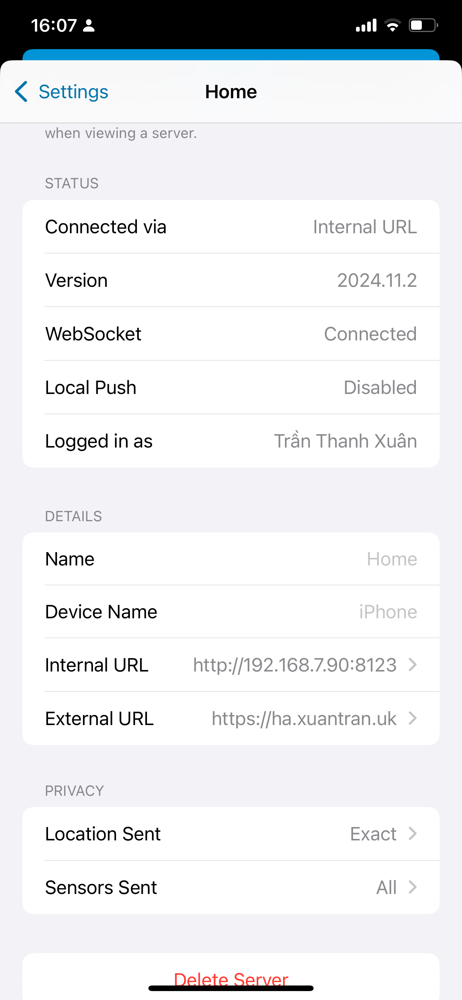
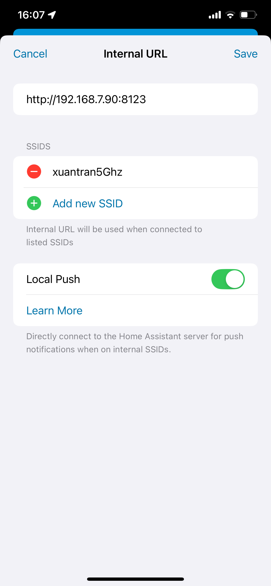

# Hướng dẫn này dành cho các bạn sử dụng solarbox bên mình setup sẵn
## 1. Chuẩn bị dây mạng từ router đến PIN
- Do box sử dụng giao tiếp bluetooth với Pin nên cần đặt gần PIN, do vậy cần chuẩn bị dây mạng từ router đến PIN. **Lưu ý:** nên để box ngay cạnh Pin (20cm) để kết nối được ổn định nhất

- Serial number (SN) của module wifi. Xem trên web hoặc có thể xem trực tiếp trên module wifi. 

<!-- ## 2. Setup wifi biến tần -->
<!-- - Cài đặt Network Analyzer cho [Ios](https://itunes.apple.com/us/app/network-analyzer-wifi-scanner-speed-test-tools/id557405467?mt=8) hay [android](https://play.google.com/store/apps/details?id=net.techet.netanalyzer.an)
- Xác định địa chỉ IP của module wifi bằng cách scan bằng ứng dụng Network Analyzer (module wifi có tên mico) -->

<!-- - Cài dặt địa chỉ tĩnh cho module wifi
- Mở cổng 8000 cho module wifi
- Gửi thông tin: SN, địa chỉ IP cho mình
- Video hướng dẫn  -->
## 2. Đăng nhập vào ứng dụng homeassitant
- Cài đặt ứng dụng cho [ios](https://apps.apple.com/app/home-assistant/id1099568401?itsct=apps_box_badge&itscg=30200) hoặc [android](https://play.google.com/store/apps/details?id=io.homeassistant.companion.android&pcampaignid=pcampaignidMKT-Other-global-all-co-prtnr-py-PartBadge-Mar2515-1&pcampaignid=pcampaignidMKT-Other-global-all-co-prtnr-py-PartBadge-Mar2515-1)
- Cắm điện và dây mạng cho box
- Chờ khoảng 2 phút
- Đăng nhập với thông tin mình gửi. [video hướng dẫn](https://youtube.com/shorts/DpIyl63lWtc?feature=share)
- Ngắt kết nối giữa Pin và điện thoại của bạn
- Inbox mình để cài đặt từ xa (Mình sẽ cài đặt vào buổi tối)
- Đổi mật khẩu sau khi mình cài đặt xong 
<!--
- Kết nối với biến tần. Mình có thể hổ trợ từ xa hoặc bạn có thể kết nối bằng[Video hướng dẫn](https://www.youtube.com/shorts/g12Ak6pNzmc)
- Nếu gặp vấn đề gì inbox mình hỗ trợ   -->
## 3. Cài đặt kết nối với box trong mạng local
Bạn có thể truy cập server bằng 2 url:
- Internal url: ``http:// <IP box của bạn>:8123``. Truy cập nhanh hơn khi bạn đang trong cùng mạng wifi với box. Không cần kết nối internet. IP của box có thể dùng Network Analyzer ([ios](https://itunes.apple.com/us/app/network-analyzer-wifi-scanner-speed-test-tools/id557405467?mt=8) hay [android](https://play.google.com/store/apps/details?id=net.techet.netanalyzer.an)) để quét. Tên của box có thể là: SolarBox, armbian, homeassistant. **Lưu ý: set IP tĩnh cho box trên router của bạn, nếu không địa chỉ có thể thay đổi và không phải cập nhật lại trên app**
- External url: ``https://xxxx-solar.xuantran.uk``. Có thể truy cập bất cứ ở đâu miễn là địên thoại và box đều có kết nối internet.

Ví dụ: box của mình có địa chỉ 192.168.7.90 trong mạng nộ bộ xuantran5Ghz, với cài đặt dưới đây khi địen thoại mình đang kết nối vào wifi xuantran5Ghz thì sẽ kết nối với box bằng internal url để kết nối ổn định nhất:

  
  

