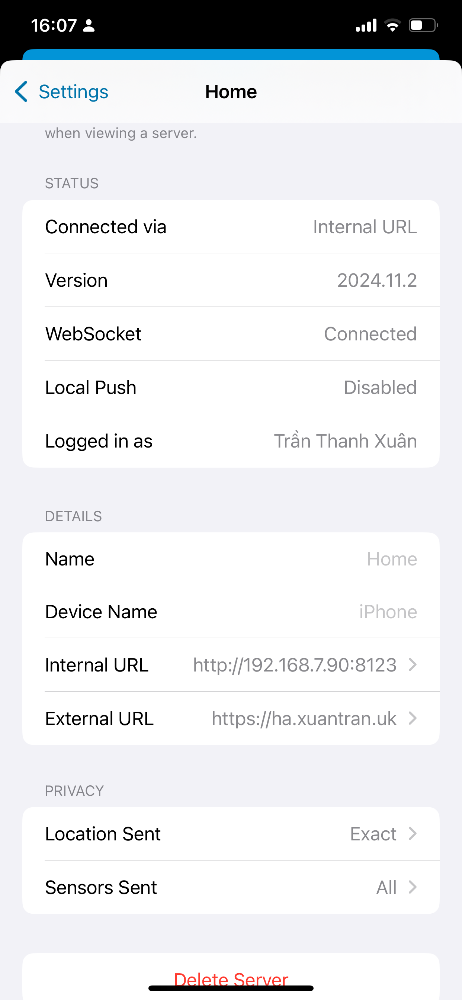
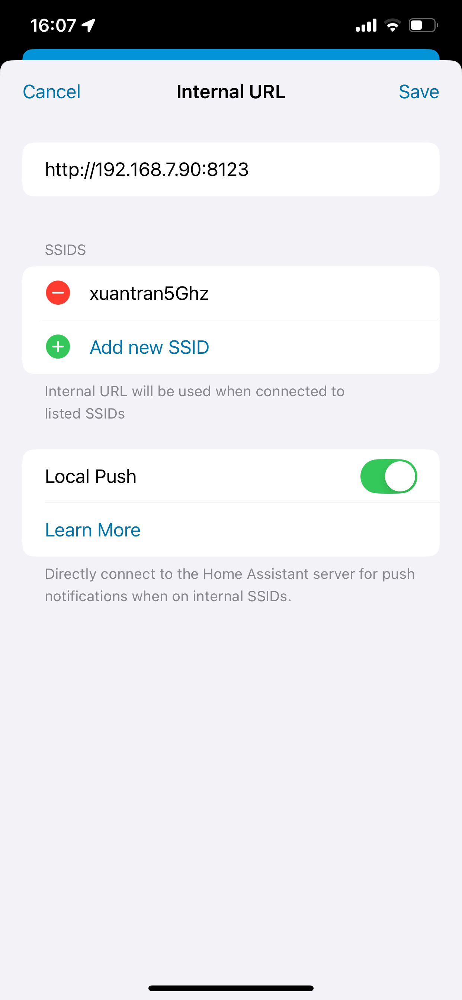

## Cài đặt kết nối với box trong mạng local
Bạn có thể truy cập server bằng 2 url:
- Internal url: ``http:// <IP box của bạn>:8123``. Truy cập nhanh hơn khi bạn đang trong cùng mạng wifi với box. Không cần kết nối internet. IP của box có thể dùng Network Analyzer ([ios](https://apps.apple.com/vn/app/network-analyzer-net-tools/id562315041) hay [android](https://play.google.com/store/apps/details?id=net.techet.netanalyzerlite.an)) để quét. Tên của box có thể là: SolarBox, armbian, homeassistant. **Lưu ý: set IP tĩnh cho box trên router của bạn, nếu không địa chỉ có thể thay đổi và không phải cập nhật lại trên app**
- External url: ``https://xxxx-solar.xuantran.uk``. Có thể truy cập bất cứ ở đâu miễn là địên thoại và box đều có kết nối internet.

Ví dụ: box của mình có địa chỉ 192.168.7.90 trong mạng nộ bộ xuantran5Ghz, với cài đặt dưới đây khi địen thoại mình đang kết nối vào wifi xuantran5Ghz thì sẽ kết nối với box bằng internal url để kết nối ổn định nhất:

  
  

